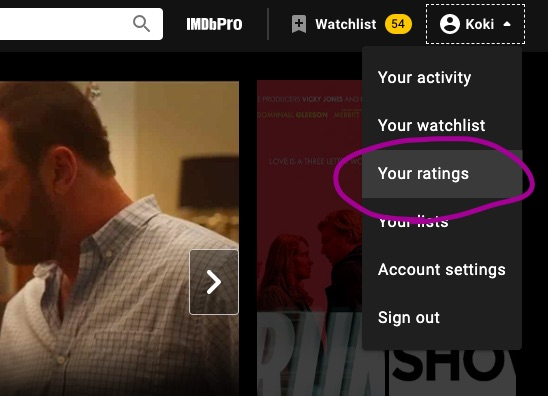
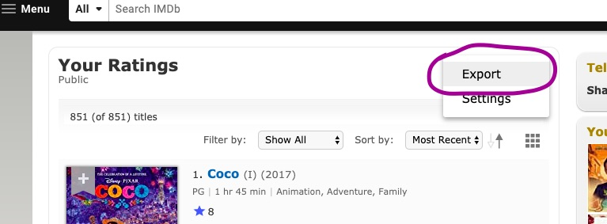
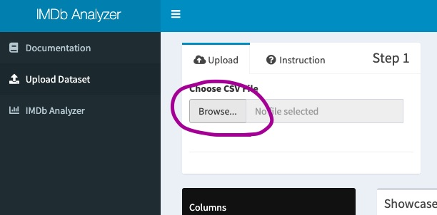

# 🔧 Setup dataset 🔧

To explore your movie activities, you have to upload your dataset. In this page, you will find everything you need know before using IMDb Analyzer and how to upload your dataset step by step.

## Step1: (Create and) Login to your IMDb Account

To keep your viewing activities, you need IMDb account. To set up your, see the official [Registration](https://www.imdb.com/registration/signin?ref_=helpms_ih_gi_whyregister) page provided by IMDb.

After (creating and) log into your account, go to 'Your ratings' page as shown below.

## Step2: Download your data

On 'Your ratings' page, you can find a list of movies you have reviewed before.

Click the tab on the right side and export your rating data.

## Step3: Upload data to IMDb Analyzer

Now you are ready to go! 

Upload your rating data to analyze and explore!

